# de-udacity-nanodegree-project-04

In this repository, I present my solution for the STEDI Human Balance Analytics project. This project is part of Udacity's Nanodegree in [Data Engineering with AWS](https://www.udacity.com/course/data-engineer-nanodegree--nd027) program.

# Project Introduction: STEDI Human Balance Analytics

In this project, you'll act as a data engineer for the STEDI team to build a data lakehouse solution for sensor data that trains a machine learning model.

# Project Details

The STEDI Team has been hard at work developing a hardware STEDI Step Trainer that:

- trains the user to do a STEDI balance exercise;
- and has sensors on the device that collect data to train a machine-learning algorithm to detect steps;
- has a companion mobile app that collects customer data and interacts with the device sensors.

STEDI has heard from millions of early adopters who are willing to purchase the STEDI Step Trainers and use them.

Several customers have already received their Step Trainers, installed the mobile application, and begun using them together to test their balance. The Step Trainer is just a motion sensor that records the distance of the object detected. The app uses a mobile phone accelerometer to detect motion in the X, Y, and Z directions.

The STEDI team wants to use the motion sensor data to train a machine learning model to detect steps accurately in real-time. Privacy will be a primary consideration in deciding what data can be used.

Some of the early adopters have agreed to share their data for research purposes. Only these customers’ Step Trainer and accelerometer data should be used in the training data for the machine learning model.

# Project Summary

As a data engineer on the STEDI Step Trainer team, you'll need to extract the data produced by the STEDI Step Trainer sensors and the mobile app, and curate them into a data lakehouse solution on AWS so that Data Scientists can train the learning model.

# Project Environment

## AWS Environment

You'll use the data from the STEDI Step Trainer and mobile app to develop a lakehouse solution in the cloud that curates the data for the machine learning model using:

- Python and Spark
- AWS Glue
- AWS Athena
- AWS S3

## Github Environment

You'll also need a github repository to store your SQL scripts and Python code in. You'll submit the code in this github repo for the project submission.

## Workflow Environment Configuration

You'll be creating Python scripts using AWS Glue and Glue Studio. These web-based tools and services contain multiple options for editors to write or generate Python code that uses PySpark. Remember to save any code you develop or run in these editors on AWS to a local Github Repository.

You can use any Python editor locally to work with and save code as well, but be aware that to actually test or run Glue Jobs, you'll need to submit them to your AWS Glue environment.

# Project Data

STEDI has three JSON data sources to use from the Step Trainer. Check out the JSON data in the following subdirectories of [data/](data/):

- [customer/](data/customer/)
- [step_trainer/](data/step_trainer/)
- [accelerometer](data/accelerometer/)

These files were downloaded from the [nd027-Data-Engineering-Data-Lakes-AWS-Exercises](https://github.com/udacity/nd027-Data-Engineering-Data-Lakes-AWS-Exercises/tree/main/project/starter) repository.

You should have:

- 956 rows in the customer_landing table,
- 81,273 rows in the accelerometer_landing table, and
- 28,680 rows in the step_trainer_landing table.

1. Customer Records

This is the data from fulfillment and the STEDI website.


Contains the following fields:

- serialnumber
- sharewithpublicasofdate
- birthday
- registrationdate
- sharewithresearchasofdate
- customername
- email
- lastupdatedate
- phone
- sharewithfriendsasofdate

2. Step Trainer Records

This is the data from the motion sensor.

Contains the following fields:

- sensorReadingTime
- serialNumber
- distanceFromObject

3. Accelerometer Records

This is the data from the mobile app.

Contains the following fields:

- timeStamp
- user
- x
- y
- z

The project [README](https://github.com/udacity/nd027-Data-Engineering-Data-Lakes-AWS-Exercises/blob/main/project/README.md) in the Github repo explains in details the project structure and some known issues.

# Project Directory Tree

```
.
├── LICENSE
├── README.md
├── assets
│   ├── accelerometer_from_landing_to_trusted_glue_job.png
│   ├── customer_from_landing_to_trusted_glue_job.png
│   ├── customer_from_trusted_to_curated_glue_job.png
│   ├── filtered_accelerometer_trusted.png
│   ├── ml_curated_glue_job.png
│   └── step_trainer_trusted_glue_job.png
├── data
│   ├── README.md
│   ├── accelerometer
│   │   └── landing
│   │       ├── accelerometer-1691348231445.json
│   │       ├── accelerometer-1691348231495.json
│   │       ├── accelerometer-1691348231576.json
│   │       ├── accelerometer-1691348231724.json
│   │       ├── accelerometer-1691348231810.json
│   │       ├── accelerometer-1691348231881.json
│   │       ├── accelerometer-1691348231931.json
│   │       ├── accelerometer-1691348231983.json
│   │       └── accelerometer-1691348232031.json
│   ├── customer
│   │   └── landing
│   │       └── customer-1691348231425.json
│   └── step_trainer
│       └── landing
│           ├── step_trainer-1691348232038.json
│           ├── step_trainer-1691348232085.json
│           └── step_trainer-1691348232132.json
├── imgs
│   ├── curated
│   │   ├── count_of_customer_curated.png
│   │   ├── count_of_machine_learning_curated.png
│   │   ├── customer_curated_sample.png
│   │   └── machine_learning_curated.png
│   ├── landing
│   │   ├── accelerometer_landing.png
│   │   ├── count_of_accelerometer_landing.png
│   │   ├── count_of_customer_landing.png
│   │   ├── count_of_nulls_in_customer_landing_sharewithresearchasofdate.png
│   │   ├── count_of_step_trainer_landing.png
│   │   ├── customer_landing.png
│   │   └── step_trainer_landing.png
│   └── trusted
│       ├── count_of_accelerometer_trusted.png
│       ├── count_of_customer_trusted.png
│       ├── count_of_nulls_in_customer_trusted_sharewithresearchasofdate.png
│       ├── count_step_trainer_trusted.png
│       └── customer_trusted.png
├── scripts
│   ├── accelerometer_landing_to_trusted.py
│   ├── customer_landing_to_trusted.py
│   ├── customer_trusted_to_curated.py
│   ├── machine_learning_curated.py
│   └── step_trainer_trusted.py
└── sql_queries
    └── landing
        ├── accelerometer_landing.sql
        ├── customer_landing.sql
        └── step_trainer_landing.sql

16 directories, 46 files
```

## [sql_queries](sql_queries/)

Contains the DDL SQL queries that create the tables `customer_landing`, `accelerometer_landing`, and `step_trainer_landing`.

- [customer_landing.sql](sql_queries/landing/customer_landing.sql)
- [accelerometer_landing.sql](sql_queries/landing/accelerometer_landing.sql)
- [step_trainer_landing.sql](sql_queries/landing/step_trainer_landing.sql)

The relationships between these tables are depicted in the following diagram

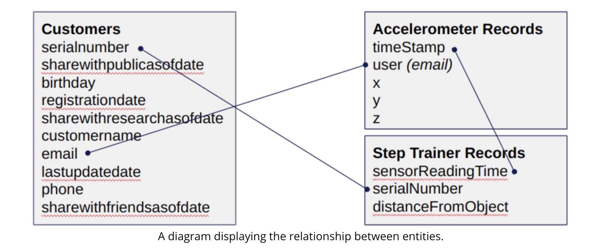

## [scripts](scripts/)

There are five Glue Job scripts in this directory.

### [customer_landing_to_trusted.py](scripts/customer_landing_to_trusted.py)

- Sanitizes the Customer data from the Website (Landing Zone) and only store the Customer Records who agreed to share their data for research purposes (Trusted Zone).

- Creates a Glue Table called customer_trusted.

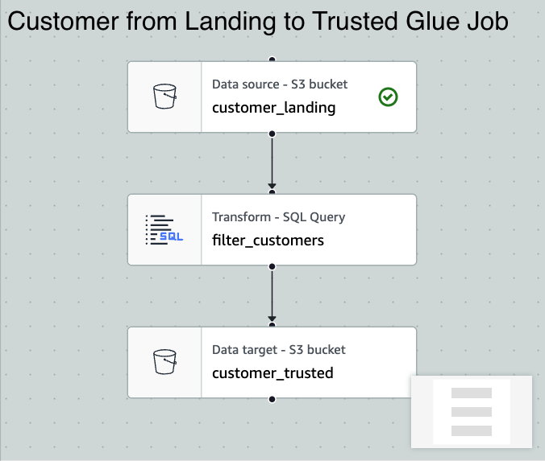

### [accelerometer_landing_to_trusted.py](scripts/accelerometer_landing_to_trusted.py)

- Sanitizes the Accelerometer data from the Mobile App (Landing Zone) - and only store Accelerometer Readings from customers who agreed to share their data for research purposes (Trusted Zone) -

- Creates a Glue Table called `accelerometer_trusted`.

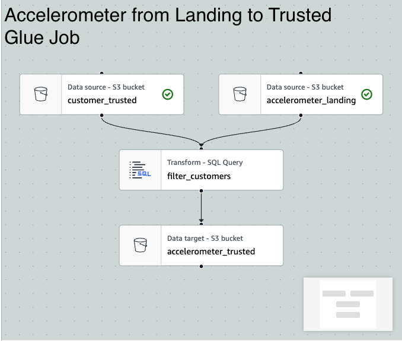

### [customer_trusted_to_curated.py](scripts/customer_trusted_to_curated.py)

- Sanitizes the Customer data (Trusted Zone) and create a Glue Table (Curated Zone) that only includes customers who have accelerometer data and have agreed to share their data for research called customers_curated.

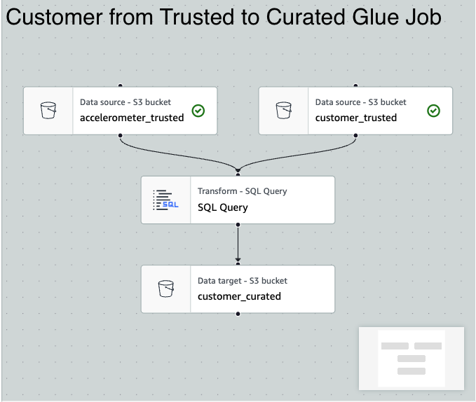

### [step_trainer_trusted.py](scripts/step_trainer_trusted.py)

- Reads the Step Trainer IoT data stream (S3) and populate a Trusted Zone Glue Table called step_trainer_trusted that contains the Step Trainer Records data for customers who have accelerometer data and have agreed to share their data for research (customers_curated).

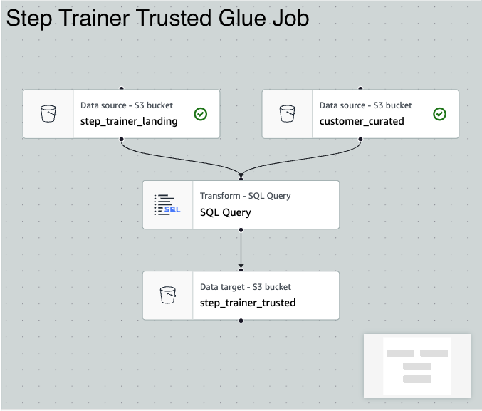

### [machine_learning_curated.py](scripts/machine_learning_curated.py)

- Creates an aggregated table that has each of the Step Trainer Readings, and the associated accelerometer reading data for the same timestamp, but only for customers who have agreed to share their data, and make a glue table called machine_learning_curated.

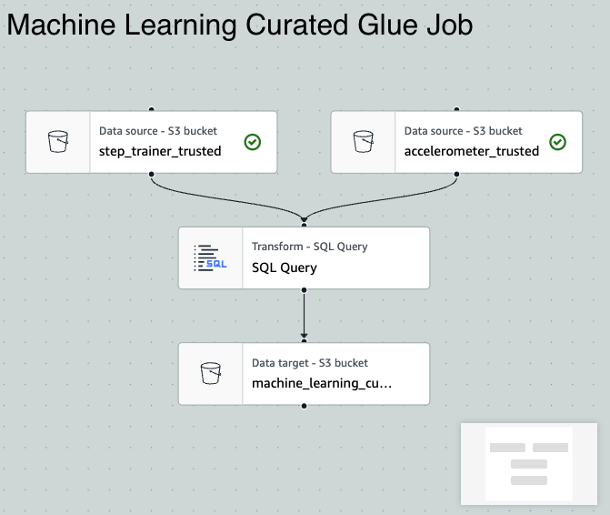

## [data](data/)

Already described in the [Project Data](#project-data) section.

## [imgs](imgs/)

It has three subdirectories containing the Athena SQL queries screenshots of the tables in the landing, trusted, and curated zones.

### [imgs/landing](imgs/landing/)

#### Customer Landing

- Customer landing sample

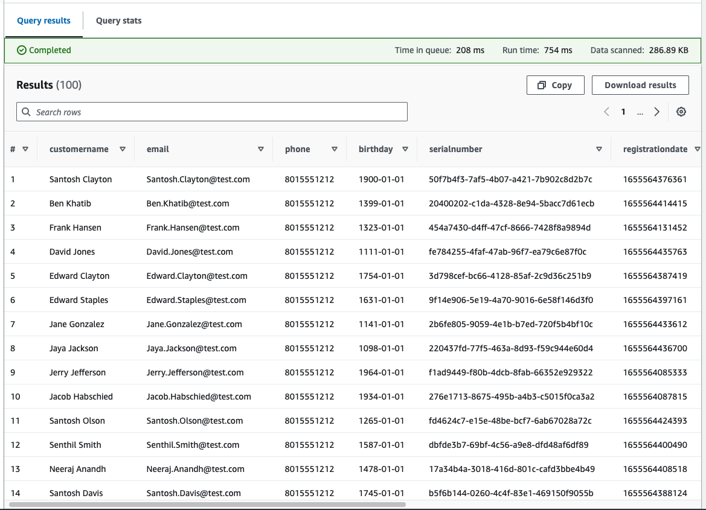

- Count of customer landing

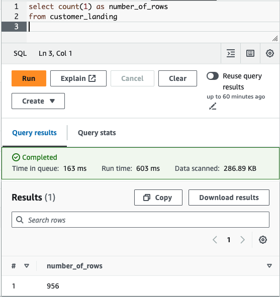

- Count of nulls in sharewithresearchofdate column in customer landing

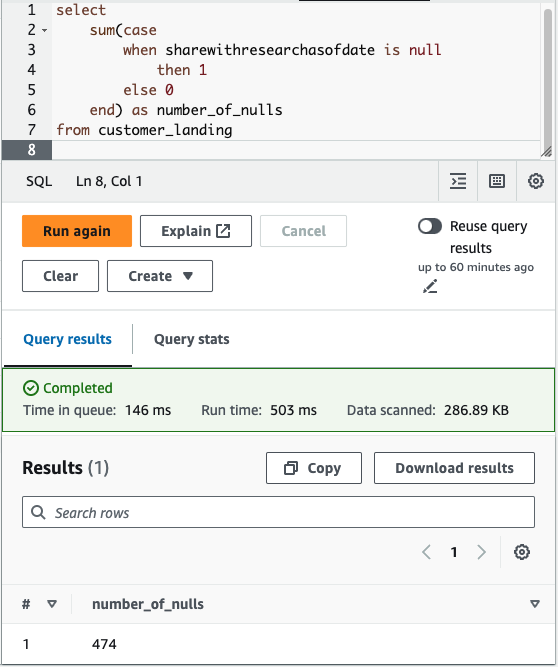

#### Accelerometer Landing

- Accelerometer landing sample

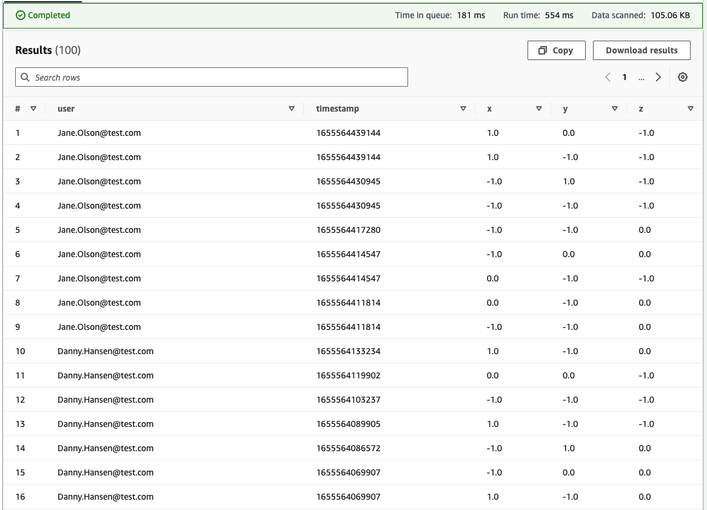

- Count of accelerometer landing

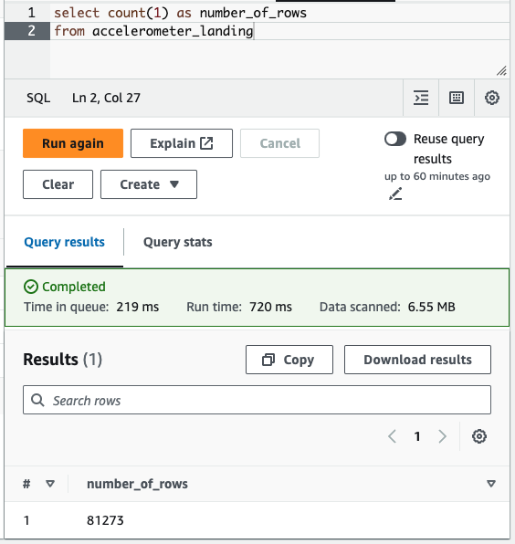

#### Step Trainer Landing

- Step trainer landing sample

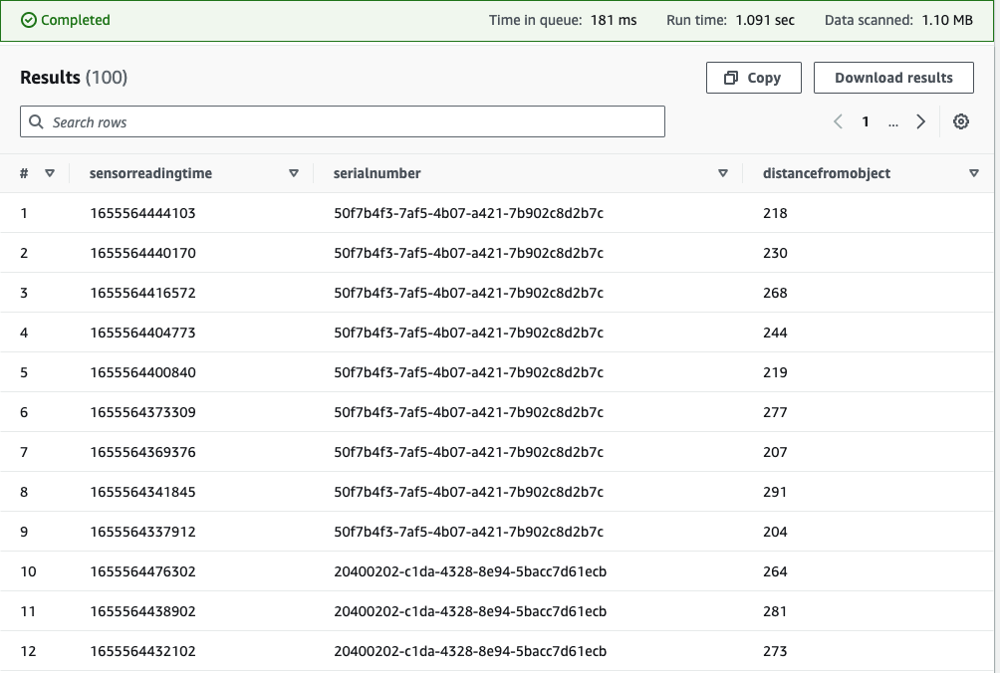

- Count of step trainer landing

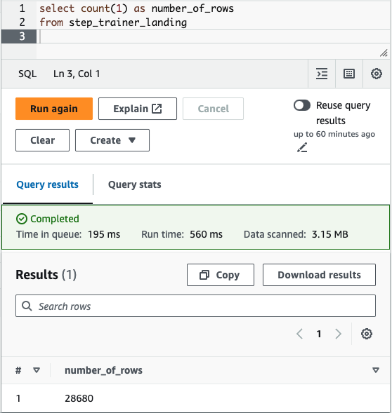

### [imgs/trusted](imgs/trusted/)

#### Customer Trusted

- Customer trusted

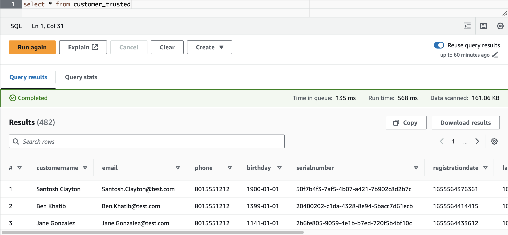

- Count of customer trusted

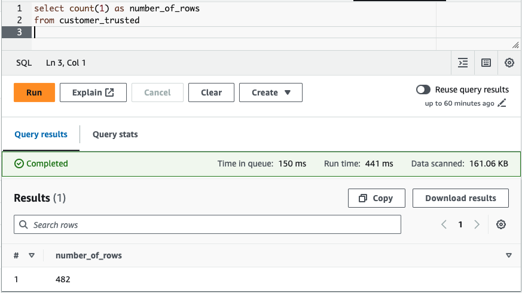

- Count of nulls in sharewithresearchofdate column in customer trusted

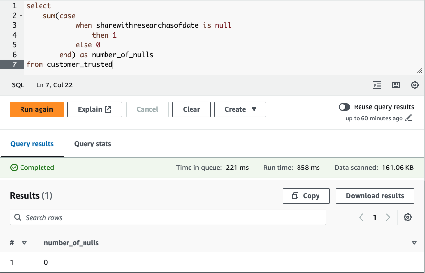

#### Accelerometer Trusted

- Count of accelerometer trusted

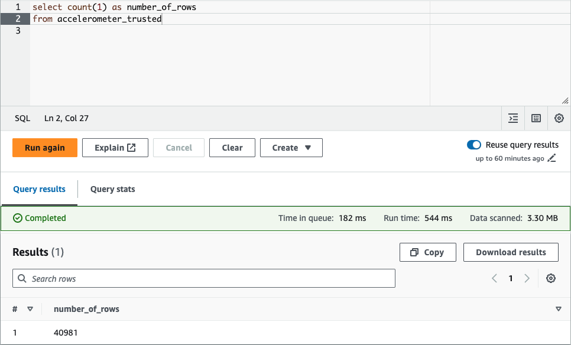

#### Step Trainer Trusted

- Count of step trainer trusted

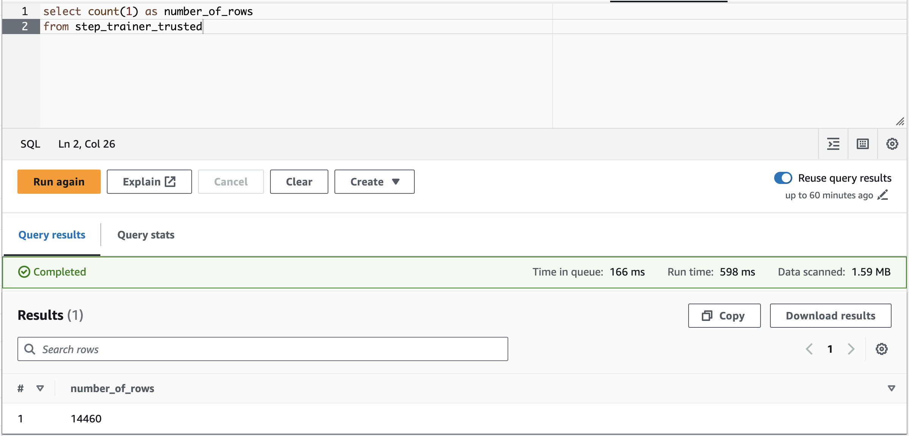

### [imgs/curated](imgs/curated/)

#### Customer Curated

- Customer curated sample

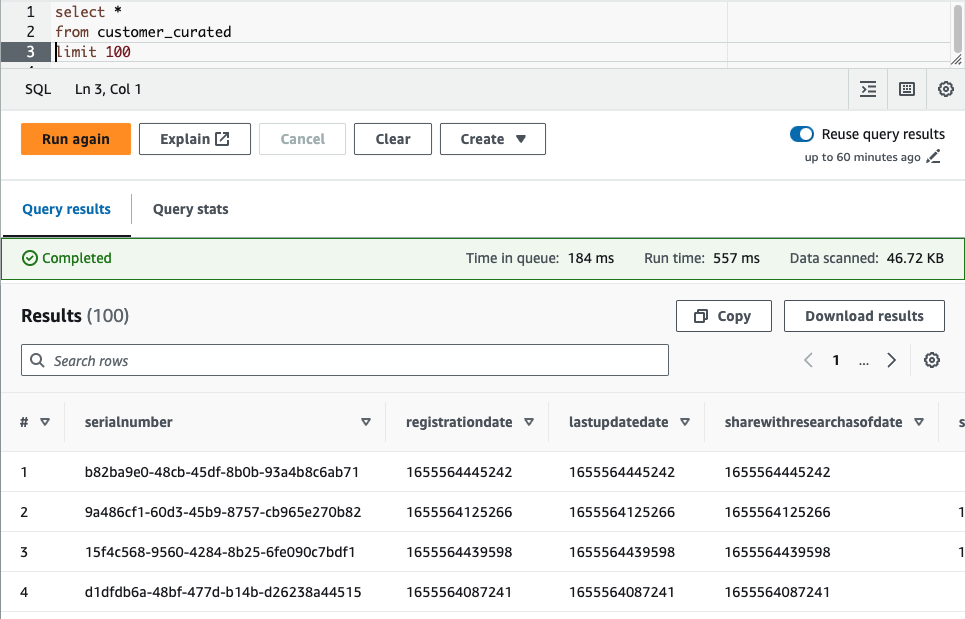

- Count of customer curated

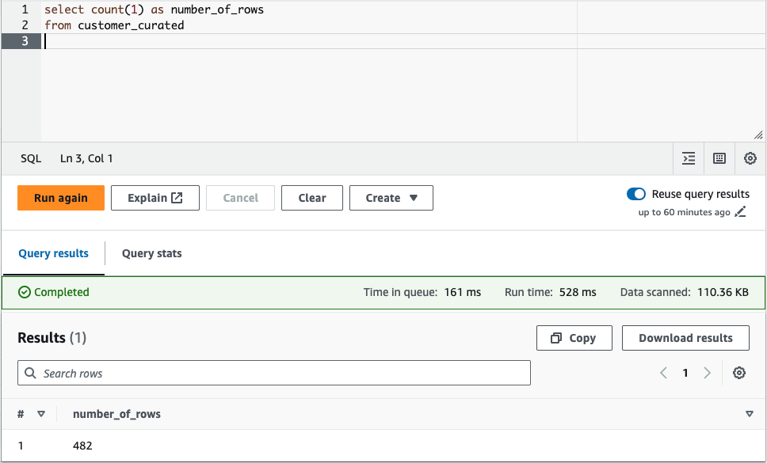

- Machine learning curated

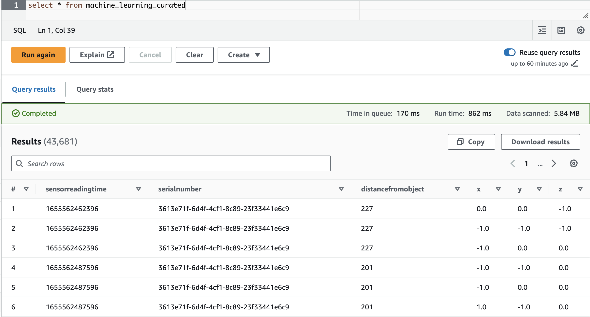

- Count of machine learning curated

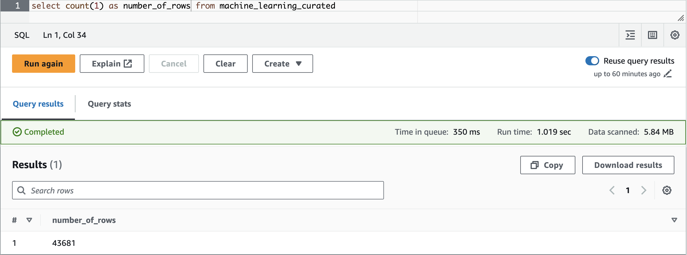

## [assets](assets/)

A few images linked in the README file.

## Other files

- README
- LICENSE
- .gitignore
- .editorconfig
